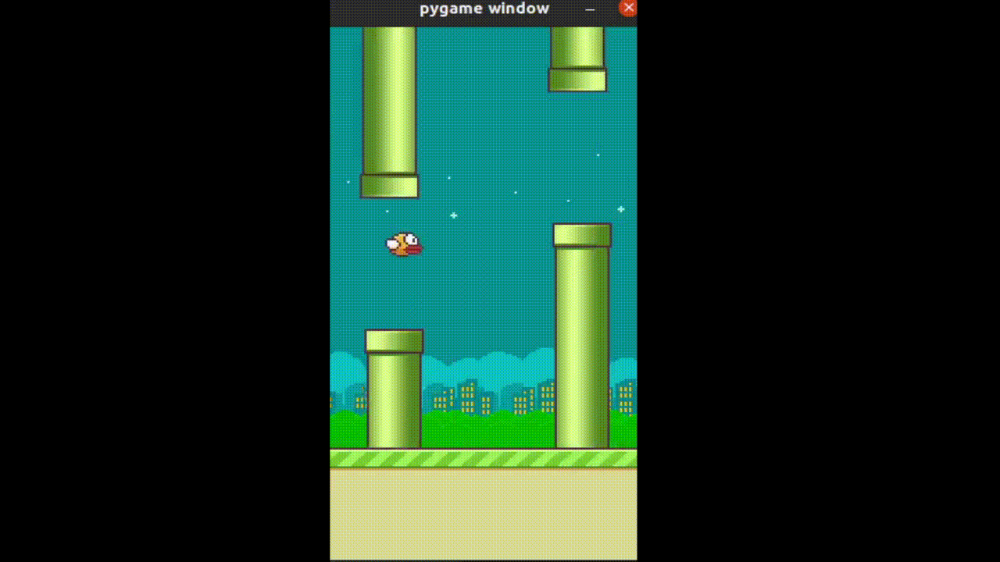

# evolutionary-reinforcement-learner
Implementations of evolutionary algorithms for reinforcement learning, with examples for testing the algorithms on Flappy Bird and Ms. Pac-man.



## Implemented Algorithms

Custom, ground-up implementations of the evolutionary strategy (ES) and policy gradients with parameter-based exploration (PGPE), and a wrapper for covariance matrix adative evolutionary strategy (CMAES) implemented with the Python CMA library.  

A custom multi-layer perceptron (MLP) is provided, but it is also possible to define your own neural network in Tensorflow and pass it to the EvolutionaryModel wrapper so that it is optimized with an evolutionary algorithm instead of TF optimizers.  See examples.py and the documentation below for examples of how to do that.

To help you define your own TF neural network, this module includes a neural architecture search (NAS) implementation that allows architecture to be optimized, without training!  This implementation uses the score proposed by Mellor, Turner, Storky, & Crowley, 2021 (https://arxiv.org/abs/2006.04647).  

### Sources for the evolutionary algorithm implementations
Evolutionary Strategy: Beyer & Schwefel, 2002 (https://www.researchgate.net/publication/220132816_Evolution_strategies_-_A_comprehensive_introduction)

Covariance Matrix Adaptive Evolutionary Strategy:  Hansen, 2016 (https://arxiv.org/abs/1604.00772)

Policy Gradients with Parameter-Based Exploration: Sehnke, Osendorfer, Tuckstieb, & Graves, 2008 (https://www.researchgate.net/publication/221079957_Policy_Gradients_with_Parameter-Based_Exploration_for_Control)

# How to Run

To run, bash into the container.  Create a data folder to hold the model weights:

```
docker build .
docker run -it <name_of_container> /bin/bash
mkdir data
```

To run tests from the root directory, after bashing into container:

```
python3 -m pytest tests
```

To run examples from the root directory, after bashing into container:

```
python3 examples.py
```

You will not be able to see the games being played out in Pygame when running from within a container, because your video device will be inaccessible.  To see the games being played, you will need to run the examples outside of a container.  This will require installing requirements.txt, and downloading/extracting the Atari ROMs.  Copy the lines run in the Dockerfile to do this.

# Folder Structure

### environments

Contains wrappers for Pygame Learning Environment (PLE) and OpenAI Gym environments.  The wrappers standardize the way the environments work.

### models

Contains a custom multi-layer perceptron (MLP) and a wrapper for models created with Tensorflow.  The Tensorflow wrapper uses Tensorflow's model architecture as a shell of sorts.  Models created with Tensorflow are not optimized with TF, but with the optimizers defined in this module instead. 

### Optimizers

Contains optimization algorithms:
* Evolutionary Strategy (ES)
* Covariance Matrix Adaptive Evolutionary Strategy (CMAES)
* Policy Gradients with Parameter Based-Exploration (PGPE)
